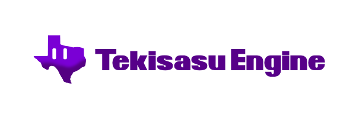

# Tekisasu Engine

    

## A free and open source gaming engine rebooted

[Tekisasu Engine](https://dev.tekisasu.com) is a feature-rich, 
multi-platform, open-source game engine capable of running 2D
and 3D projects on a number of different platforms.

This project (except for the Tekisasu logo assets which are the
property of Tekisasu) are licensed under the Expat license, except
where otherwise indicated.

Tekisasu Engine is a fork of Godot.
